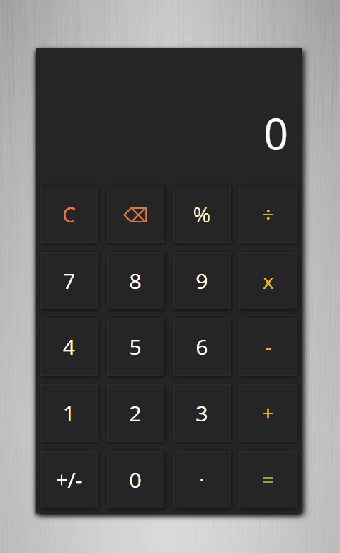

## Calculator App

A Standard Calculator capable of calculating basic mathematical
operations while adhering to the PEMDAS Operator Precedence.

This calculator displays the user's operation which could help users
understand the operator precedence used to achieve the displayed result.

Not to forget, users can also use the keyboard!

Here's a demo of the app:

Feel free to [use the app here](https://oluwatobi-s.github.io/calculator/).

**Note:**

This project is part of my [WEB DEVELOPMENT JavaScript](https://www.theodinproject.com/courses/web-development-101/lessons/calculator) 
training at The Odin Project.